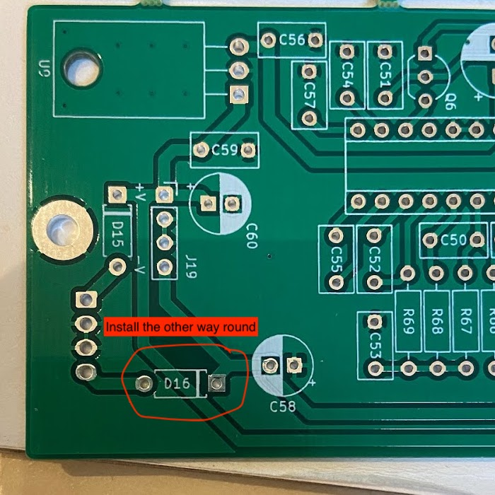

# Fixes

Fixes and caveats for any versions of the PCB that need them.

## Revision 5

No errors so far.

## Revision 4

The silkscreen for J16 is on the wrong side of the board. Make sure to install the pin header on the other side.

## Revision 3

The D16 polarity protection diode symbol is reversed on the PCB. Make sure to install with the cathode going to the power input.

Also J16 error present in rev4 above.
